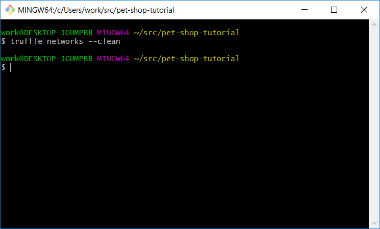

# Module 11 - Beginner Lab: Ethereum Pet Shop DApp Case Study

## Background
After having gone through the [Ethereum Pet Shop Truffle tutorial][pet-shop-tutorial] (1 hour), we will take a closer look at the data flow in the Ethereum Pet Shop DApp.

## Meta Information
| Attribute | Explanation |
| - | - |
| Summary | A case study examining the data flow in the operation of a simple DApp |
| Topics | Ethereum, DApps, blockchains, transactions, and web3. |
| Audience | CS1 or later. |
| Difficulty | Beginner. |
| Strengths | Looks at the use of blockchain technology in a simple, decentralized application. |
| Weaknesses | Relies on separate tutorial having been successfully completed. |
| Dependencies | Truffle, Ganache, MetaMask, and a computer with suitable browser (Chrome, Firefox, etc.). |
| Variants | No. |

## Assignment Instructions
1. Reset everything.
    * Open your browser with MetaMask installed.
    * Click the **MetaMask icon**.
    * Click on the **account icon** in the top-right corner.
    * Click **Log out**.	
    * Close your browser.
    * Launch the Ganache GUI.
    * Click the **gear icon** in the top-right corner.
    * Select the **ACCOUNTS & KEYS** tab.
    * Enable **AUTOGENERATE HD MNEMONIC**.
	
    * Click **SAVE AND RESTART** in the top-right corner.
	
    * Click the **gear icon** in the top-right corner.
	
    * Select the **ACCOUNTS & KEYS** tab.
    * Disable **AUTOGENERATE HD MNEMONIC**.
	
    * Click **SAVE AND RESTART** in the top-right corner.
	
    * Open a Git Bash prompt.
    * Change directory into the pet-shop-tutorial folder.
    * Run `truffle networks --clean`.
	
2. Make initial observations.
    * Select the **ACCOUNTS** tab.
    * Observe that all accounts have 100.00 ETH.
	
    * Switch to the **BLOCKS** tab.
    * Observe the newly created genesis block.
	
    * Switch to the **TRANSACTIONS** tab.
    * Observe that there are no transactions.
	
3. Initialize the pet shop DApp.
    * Open a Git Bash prompt.
    * Change directory into the pet-shop-tutorial folder.
    * Run `truffle migrate`.
	
4. Observe the output.
    * Switch window back to the Ganache GUI and select the **ACCOUNTS** tab.
    * Observe that the first account balance has changed.
	
    * Switch to the **BLOCKS** tab.
    * Observe 4 newly created blocks.
	
    * Switch to the **TRANSACTIONS** tab.
    * Observe the 4 new transactions.
	
5. Run the pet shop DApp
    * Switch back to the Git Bash prompt.
    * Run `npm run dev`.
	
    * A new tab in your browser should open displaying the pet shop.
6. Sign in to MetaMask using the mnemonic phrase in Ganache.
    * In MetaMask, click **Import using account seed phrase**.
	
    * Switch to the Ganache GUI.
    * Select and copy (`CTRL+C`) the **MNEMONIC** phrase.
    * Switch back to your browser and paste (`CTRL+V`) the phrase into the _Wallet Seed_ box in MetaMask.
    * Create and confirm a new password in MetaMask.
	
7. Confirm the connection to Pete's Pet Shop.  
	
8. Adopt a dog.
    * Choose a dog, and click **Adopt**.
    * In the MetaMask pop-up, click **Confirm**.
        * If all went well, `Adopt` will have changed to `Success`.
	
9. Observe the output.
    * Switch to the Ganache GUI.
    * Select the **BLOCKS** tab.
    * Observe 1 newly created block.
	
    * Select the **TRANSACTIONS** tab.
    * Observe the new `CONTRACT CALL` transaction, which brings the count to 5.
	

## Questions
1. Why do we run `truffle migrate`?
    * It deploys the smart contracts, which are the backend of the DApp.
2. Why are we using Ganache instead of the Ethereum Main Network?
    * Ganache creates a local blockchain, which is free and doesn’t require interacting with a test-currency faucet.

## Credits
Dr. Debasis Bhattacharya  
Mario Canul  
Saxon Knight  
https://www.trufflesuite.com/tutorials/pet-shop  

[pet-shop-tutorial]: https://www.trufflesuite.com/tutorials/pet-shop
